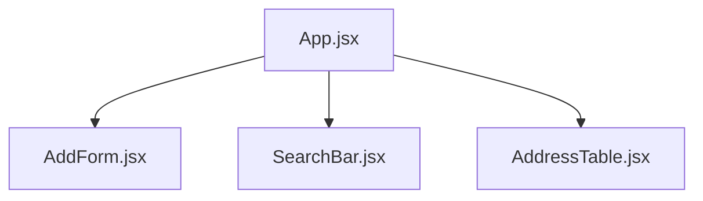
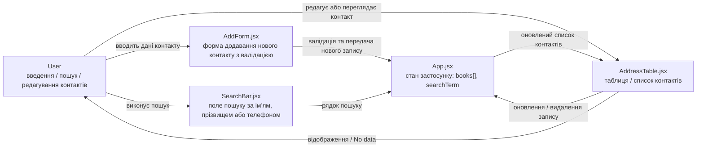

Address Book
---
Сучасний застосунок для керування адресною книгою (списком контактів), створений на Vite + React 18
---
## 🚀 Стек технологій
⚡ Vite – надшвидкий сучасний збірник для React
⚛️ React 18 – бібліотека для створення інтерфейсів
🎨 Custom CSS – сучасне оформлення з темною темою та адаптивністю
---
## 🚀 Запуск проєкту
```
# встановлення залежностей
npm install

# запуск у dev режимі
npm run dev

# білд у продакшн
npm run build

# попередній перегляд білда
npm run preview
```
---
---
##  📂 Структура проєкту
```
address-book/
├── src/
│   ├── components/
│   │   ├── AddForm.jsx        # Форма додавання нового контакту з валідацією
│   │   ├── SearchBar.jsx      # Пошук за ім’ям, прізвищем або телефоном
│   │   └── AddressTable.jsx   # Таблиця або картковий список контактів
│   ├── styles.css             # Глобальні стилі (темна тема, кнопки, поля)
│   ├── App.jsx                # Головний компонент — управляє станом і логікою
│   └── main.jsx               # Точка входу в застосунок
├── index.html
└── package.json
```
---
## 🌳 Component Tree


---
## 🔄 Data Flow Diagram (DFD) — Address Book


---
