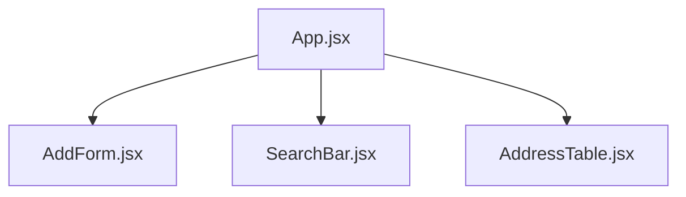
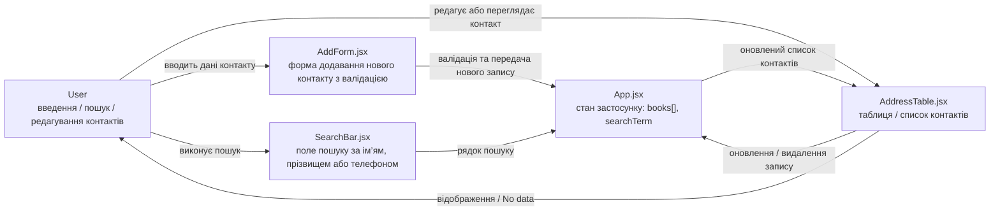

Address Book
---
Сучасний застосунок для керування адресною книгою (списком контактів), створений на Vite + React 18
---
## 🚀 Стек технологій
⚡ Vite – надшвидкий сучасний збірник для React
⚛️ React 18 – бібліотека для створення інтерфейсів
🎨 Custom CSS – сучасне оформлення з темною темою та адаптивністю
---
## 🚀 Запуск проєкту
```
# встановлення залежностей
npm install

# запуск у dev режимі
npm run dev

# білд у продакшн
npm run build

# попередній перегляд білда
npm run preview
```
---
---
##  📂 Структура проєкту
```
address-book/
├── src/
│   ├── components/
│   │   ├── AddForm.jsx        # Форма додавання нового контакту з валідацією
│   │   ├── SearchBar.jsx      # Пошук за ім’ям, прізвищем або телефоном
│   │   └── AddressTable.jsx   # Таблиця або картковий список контактів
│   ├── styles.css             # Глобальні стилі (темна тема, кнопки, поля)
│   ├── App.jsx                # Головний компонент — управляє станом і логікою
│   └── main.jsx               # Точка входу в застосунок
├── index.html
└── package.json
```
---
## 🌳 Component Tree


---
## Опис 
App.jsx є головним компонентом, який об’єднує всю логіку роботи програми та містить спільний стан — список контактів і пошуковий запит.
Він передає дані та функції дочірнім компонентам через props, що реалізує принцип Lifting State Up.

AddForm.jsx
Компонент форми для додавання нових контактів.
Відповідає за введення даних користувачем, перевірку полів (валідацію) та передачу нового запису в головний компонент App.

SearchBar.jsx
Компонент, що реалізує функцію пошуку за іменем, прізвищем або номером телефону.
Кожна зміна в полі пошуку миттєво оновлює стан у App, завдяки чому фільтрація відбувається в реальному часі.

AddressTable.jsx
Компонент для відображення списку контактів у таблиці або картковому вигляді.
Отримує масив даних через props, підтримує редагування записів і відображення повідомлення, якщо список порожній.

---
## 🔄 Data Flow Diagram (DFD) — Address Book


---
## Опис
App.jsx виконує роль центрального керуючого елемента, який зберігає стан програми (масив контактів books[] і рядок пошуку searchTerm) та передає дані між усіма компонентами.

Основні елементи діаграми:

User – взаємодіє із застосунком: вводить дані, шукає або редагує контакти.

AddForm.jsx – форма для додавання нового контакту з валідацією полів. Після успішного заповнення передає дані у App.jsx.

SearchBar.jsx – поле пошуку, яке змінює значення searchTerm у App.jsx. При кожній зміні виконується миттєва фільтрація контактів.

AddressTable.jsx – компонент для відображення, редагування або видалення контактів. Отримує список із App.jsx і реагує на зміни стану.

Логіка взаємодії:

Користувач вводить новий контакт через AddForm.jsx.

Компонент виконує валідацію та передає дані в App.jsx.

App.jsx оновлює масив контактів і надсилає оновлені дані в AddressTable.jsx.

Користувач може здійснити пошук через SearchBar.jsx, який змінює стан пошуку у App.jsx.

Відфільтрований список відображається у AddressTable.jsx.

При редагуванні або видаленні запису зміни повертаються у App.jsx, де оновлюється загальний стан програми.

---
## Патерни, використані для виведення таблиці

У процесі реалізації таблиці контактів у компоненті AddressTable були застосовані такі основні патерни проєктування React:

1. Lifting State Up (Підняття стану вгору)

Усі дані (масив контактів та пошуковий термін) зберігаються у головному компоненті App, а таблиця отримує їх через властивості (props).
Це забезпечує єдиний центр управління станом і синхронізує зміни між усіма компонентами.

2. Controlled Components (Керовані компоненти)

Поля введення під час редагування контактів є контрольованими компонентами: їхній стан керується React через змінні стану та обробники подій.
Це гарантує узгодженість даних між інтерфейсом і внутрішнім станом програми.

3. Conditional Rendering (Умовне відображення)

Використовується умовне відображення для керування виглядом таблиці залежно від стану даних.
Якщо список порожній, на екрані відображається повідомлення «No data to display», а під час редагування рядка поля таблиці замінюються на елементи введення.

4. Separation of Concerns (Розділення відповідальностей)

Функціональність програми поділена між окремими компонентами:
App відповідає за логіку і стан,
AddForm – за створення та валідацію контактів,
SearchBar – за пошук,
AddressTable – за відображення та редагування даних.
Таке розділення підвищує зрозумілість коду і спрощує його підтримку.

5. Reusable Component (Багаторазовий компонент)

Компонент AddressTable створено універсально: він може відображати будь-який набір даних, переданий через властивості, і підтримує повторне використання в інших проєктах.
Для побудови таблиці застосовано патерни Lifting State Up, Controlled Components, Conditional Rendering, Separation of Concerns та Reusable Component, що забезпечує чисту архітектуру, узгодженість стану та можливість повторного використання компонентів.

---
